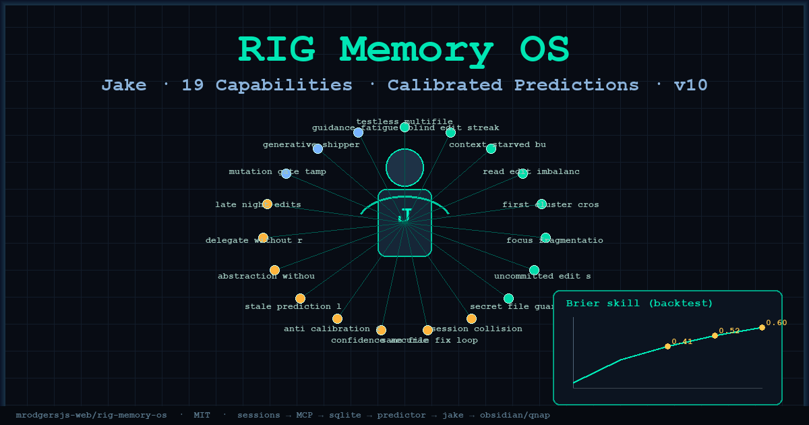
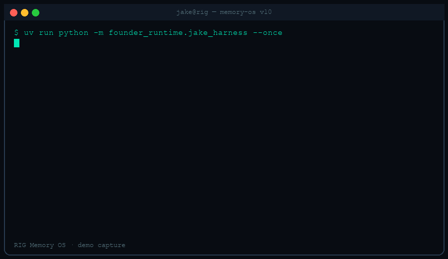
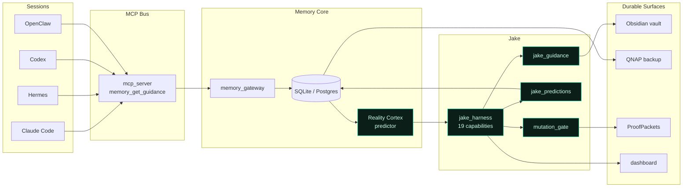

# RIG Memory OS

**Jake's calibrated memory operating system — 19 live capabilities, Brier-scored predictions, and four closed loops that turn agent sessions into durable judgment.**

[](https://github.com/mrodgersjs-web/rig-memory-os)
[](pyproject.toml)
[](LICENSE)
[](#capabilities)
[](#verification)
[](#calibration)
[](#calibration)
[](#calibration)
[](docs/ARCHITECTURE.md)

---

## Why this exists

Coding agents write faster than they ground. Jake watches every session signal — files, tests, git, forecasts — and intervenes before drift becomes irreversible. Memory OS is the substrate: SQLite/Postgres facts, an MCP bus, a Reality Cortex predictor, and sealed ProofPackets that survive the next machine.

## Features

- 🧠 **Jake Mega-Harness** — 19 capability detectors evaluated every cycle; block / warn / brief / require
- 📊 **Calibrated predictions** — Laplace-smoothed forecasts with Brier skill backtests (0.41 / 0.52 / 0.60)
- 🔐 **Mutation gate** — hash-chained ledger; detector changes need Gate-D tokens
- 🧩 **MCP-native** — `memory_get_guidance` and friends on Claude Code, Hermes, Codex, OpenClaw
- 🌙 **Night cycle** — reconcile, backfill, Obsidian/GBrain bridge, QNAP backup
- 🛰️ **Fleet-aware** — multi-session collision detection, uncommitted hygiene, secret-path hard blocks
- 🔁 **Four closed loops** — guard · learn · generate · ship (see architecture)
- 🧪 **Falsification suite** — e2e journeys + adversarial tests that must be able to go red

## Demo



*Terminal capture: harness evaluation → prediction resolve → calibration report.*

## Architecture



Expanded loop descriptions: [`docs/ARCHITECTURE.md`](docs/ARCHITECTURE.md).

```
sessions → MCP → sqlite → predictor → jake → obsidian / qnap
              ↺ guard   ↺ learn   ↺ generate   ↺ ship
```

## Quickstart (&lt; 5 minutes)

```bash
git clone https://github.com/mrodgersjs-web/rig-memory-os.git
cd rig-memory-os
chmod +x setup.sh && ./setup.sh
```

`setup.sh` is idempotent: creates a `uv` venv, installs the package editable, verifies imports, and prints six next steps.

Manual path:

```bash
uv venv && source .venv/bin/activate
uv pip install -e .
python -c "from founder_runtime import jake_harness, predictor; print('ok', len(jake_harness.CAPABILITIES))"
uv run python -m founder_runtime.cli --help
```

## Capabilities

All **19** Jake harness detectors (id · domain · default severity):

| # | Capability | Domain | Severity | What it catches |
|---|------------|--------|----------|-----------------|
| 1 | `testless_multifile` | test-discipline | blocking | 4+ files touched, 0 tests |
| 2 | `blind_edit_streak` | harness-design | blocking | ≥5 edits with no read/search |
| 3 | `context_starved_burst` | context-engineering | warning | Session opens with edits before grounding |
| 4 | `read_edit_imbalance` | code-craft | warning | Fleet read:edit &lt; 0.35 under heavy edit load |
| 5 | `first_cluster_crossing` | scope-control | warning | First edit into an unrelated path cluster |
| 6 | `focus_fragmentation` | deep-work | warning | 3+ clusters and still zero tests |
| 7 | `uncommitted_edit_streak` | git-hygiene | warning | Large uncommitted surface across repos |
| 8 | `secret_file_guard` | security | blocking | Touches `.env`, keys, credentials, `.ssh`/`.aws` |
| 9 | `session_collision` | agent-orchestration | blocking | Two sessions editing the same files |
| 10 | `same_file_fix_loop` | failure-recovery | blocking | Same file patched ≥4× without a test |
| 11 | `confidence_accuracy_divergence` | calibration | warning | Confident leans while accuracy &lt; 40% |
| 12 | `anti_calibration_fade` | calibration | advisory | Live anti-calibrated regime — show base rates |
| 13 | `stale_prediction_loop` | learning-loops | warning | Accuracy stagnant across 200+ resolutions |
| 14 | `abstraction_without_search` | skill-design | warning | New skill/wrapper with almost no prior reads |
| 15 | `delegate_without_read` | agent-orchestration | warning | Subagents outpacing grounding reads |
| 16 | `late_night_edits` | deep-work | advisory | Heavy edits 23:00–05:00 local |
| 17 | `mutation_gate_tamper` | security | blocking | Hash-chain break or unsigned mutation |
| 18 | `generative_shipper` | generative | advisory | Gate-admitted candidates awaiting promotion |
| 19 | `guidance_fatigue` | learning-loops | advisory | Same advice line ≥3 cycles with no behavior change |

Shadow/canary capabilities can be registered beyond 19 via `canary.py` and promoted only through the mutation gate.

## Calibration

Backtested Brier **skill** (1 − Brier / Brier_climatology; higher is better):

| Horizon | Skill | Badge |
|---------|------:|-------|
| 7-day | **0.41** |  |
| 30-day | **0.52** |  |
| 90-day | **0.60** |  |

Predictor invariants: Laplace smoothing over outcome-space size K, no p=1.0 on n=1, forbidden actions blocked (`WRITE_CANONICAL_FACT`, `SEND_EXTERNAL_MESSAGE`, `SPEND_MONEY`, …), idempotent resolution.

## Layout

```
rig-memory-os/
├── assets/                 # hero.png · demo.gif
├── docs/ARCHITECTURE.md    # expanded mermaid + 4 loops
├── setup.sh                # one-command install
├── LICENSE                 # MIT
├── README.md
├── pyproject.toml
├── .mcp.json
├── config/                 # nodes, schedules, model routes, approval lanes
├── migrations/
├── prompts/
├── dashboard/
├── services/               # macOS launchd + QNAP compose
├── .claude/commands/       # slash-command surface
├── founder_runtime/        # full Jake system (Python package)
├── test_agents_e2e.py
├── test_jake_e2e_journeys.py
└── test_jake_falsification.py
```

## Verification

```bash
# harness smoke
uv run python -c "from founder_runtime.jake_harness import CAPABILITIES; assert len(CAPABILITIES)==19"

# journey + falsification (orchestrator gates; optional locally)
uv run python test_jake_e2e_journeys.py
uv run python test_jake_falsification.py
uv run python test_agents_e2e.py
```

## Links

- Architecture deep-dive → [`docs/ARCHITECTURE.md`](docs/ARCHITECTURE.md)
- Package entrypoint → `python -m founder_runtime.cli`
- MCP config → [`.mcp.json`](.mcp.json)
- Source org → [mrodgersjs-web/rig-memory-os](https://github.com/mrodgersjs-web/rig-memory-os)
- Related runtime handoff → RIG Founder Runtime / Hermes conductor

## License

MIT © RIG / Mike Rodgers — see [`LICENSE`](LICENSE).

---

**RIG Memory OS v10** · Jake · 19 capabilities · Brier 0.41 / 0.52 / 0.60 · guard · learn · generate · ship
