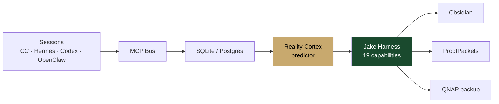

<div align="center">
  
</div>

<br/>

<div align="center">
  <h3>RIG Memory OS</h3>
  <p><em>Calibrated agent memory that turns sessions into durable judgment.</em></p>
</div>

<div align="center">


</div>

<br/>

---

> 🥇 **Coding agents write faster than they ground. Jake watches every session signal and intervenes before drift becomes irreversible.**

---

## 60-second install

```bash
git clone https://github.com/mrodgersjs-web/rig-memory-os.git
cd rig-memory-os && chmod +x setup.sh && ./setup.sh
```

> Idempotent: creates a `uv` venv, installs the package editable, verifies imports, prints six next steps.

## Calibration (the numbers)

| Horizon | Brier Skill | What it means |
|---------|------------:|---------------|
| 7-day | **0.41** | 41% better than climatology baseline at 1-week forecasts |
| 30-day | **0.52** | 52% better at 1-month — predictions compound over time |
| 90-day | **0.60** | 60% better at 3-month — the system gets smarter the longer it runs |

> Laplace smoothing over outcome-space size K. No p=1.0 on n=1. Forbidden actions blocked. Idempotent resolution. **30,000+ learned transitions.**

## How it works



**Four closed loops:** `guard` (block bad edits) → `learn` (resolve predictions) → `generate` (propose skills) → `ship` (promote on pass)

## Why it exists

- **Agents drift.** Jake's 19 capability detectors evaluate every cycle: block / warn / brief / require
- **Predictions need calibration.** Brier-scored forecasts with Laplace smoothing — no overconfidence on small samples
- **Mutations need gates.** Hash-chained ledger; detector changes need Gate-D tokens
- **Memory needs substrate.** SQLite/Postgres facts, MCP bus, Reality Cortex predictor, sealed ProofPackets

<details>
<summary><b>19 Capability Detectors</b></summary>

| # | Capability | Domain | Severity | What it catches |
|---|------------|--------|----------|-----------------|
| 1 | `testless_multifile` | test-discipline | blocking | 4+ files touched, 0 tests |
| 2 | `blind_edit_streak` | harness-design | blocking | ≥5 edits with no read/search |
| 3 | `context_starved_burst` | context-engineering | warning | Session opens with edits before grounding |
| 4 | `read_edit_imbalance` | code-craft | warning | Fleet read:edit < 0.35 under heavy edit load |
| 5 | `first_cluster_crossing` | scope-control | warning | First edit into an unrelated path cluster |
| 6 | `focus_fragmentation` | deep-work | warning | 3+ clusters and still zero tests |
| 7 | `uncommitted_edit_streak` | git-hygiene | warning | Large uncommitted surface across repos |
| 8 | `secret_file_guard` | security | blocking | Touches `.env`, keys, credentials |
| 9 | `session_collision` | agent-orchestration | blocking | Two sessions editing the same files |
| 10 | `same_file_fix_loop` | failure-recovery | blocking | Same file patched ≥4× without a test |
| 11 | `confidence_accuracy_divergence` | calibration | warning | Confident leans while accuracy < 40% |
| 12 | `anti_calibration_fade` | calibration | advisory | Live anti-calibrated regime |
| 13 | `stale_prediction_loop` | learning-loops | warning | Accuracy stagnant across 200+ resolutions |
| 14 | `abstraction_without_search` | skill-design | warning | New skill/wrapper with almost no prior reads |
| 15 | `delegate_without_read` | agent-orchestration | warning | Subagents outpacing grounding reads |
| 16 | `late_night_edits` | deep-work | advisory | Heavy edits 23:00–05:00 local |
| 17 | `mutation_gate_tamper` | security | blocking | Hash-chain break or unsigned mutation |
| 18 | `generative_shipper` | generative | advisory | Gate-admitted candidates awaiting promotion |
| 19 | `guidance_fatigue` | learning-loops | advisory | Same advice line ≥3 cycles with no behavior change |

</details>

<details>
<summary><b>Verification</b></summary>

```bash
# harness smoke
uv run python -c "from founder_runtime.jake_harness import CAPABILITIES; assert len(CAPABILITIES)==19"

# journey + falsification
uv run python test_jake_e2e_journeys.py
uv run python test_jake_falsification.py
uv run python test_agents_e2e.py
```

</details>

<details>
<summary><b>Repository layout</b></summary>

```
rig-memory-os/
├── assets/                 # hero · demo.gif
├── docs/ARCHITECTURE.md    # expanded mermaid + 4 loops
├── setup.sh                # one-command install
├── founder_runtime/         # full Jake system (Python package)
├── config/                  # nodes, schedules, model routes
├── dashboard/               # live build card intelligence view
├── services/                # macOS launchd + QNAP compose
├── .claude/commands/        # slash-command surface
├── .mcp.json                # MCP config
└── test_*.py                # e2e + journeys + falsification
```

</details>

<details>
<summary><b>Architecture deep-dive</b></summary>

Expanded loop descriptions and full Mermaid: [`docs/ARCHITECTURE.md`](docs/ARCHITECTURE.md)

```
sessions → MCP → sqlite → predictor → jake → obsidian / qnap
              ↺ guard   ↺ learn   ↺ generate   ↺ ship
```

- **MCP-native**: `memory_get_guidance` on Claude Code, Hermes, Codex, OpenClaw
- **Night cycle**: reconcile, backfill, Obsidian/GBrain bridge, QNAP backup
- **Fleet-aware**: multi-session collision detection, uncommitted hygiene, secret-path hard blocks

</details>

---

<div align="center">

<sub>Built by Mike Rodgers · Forward Deployed Engineer · <a href="https://rodgersintelligence.com">rodgersintelligence.com</a></sub>
<br/>
<sub>RIG Memory OS v10 · Jake · 19 capabilities · Brier 0.41 / 0.52 / 0.60 · guard · learn · generate · ship</sub>

</div>
