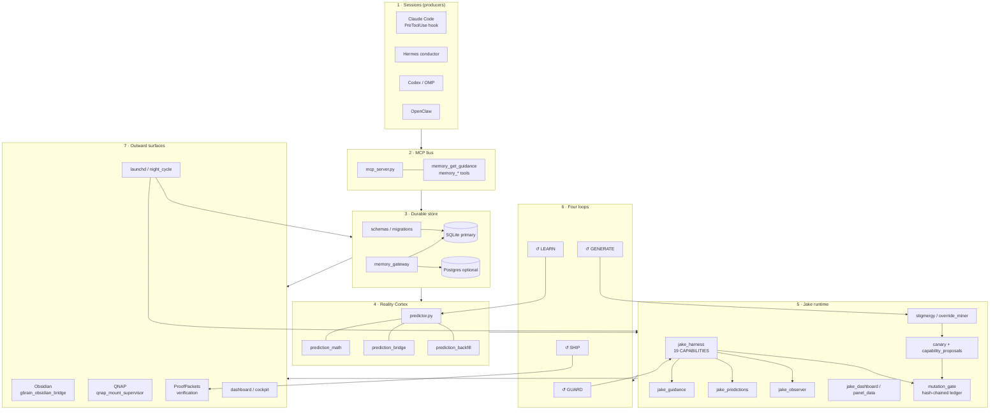
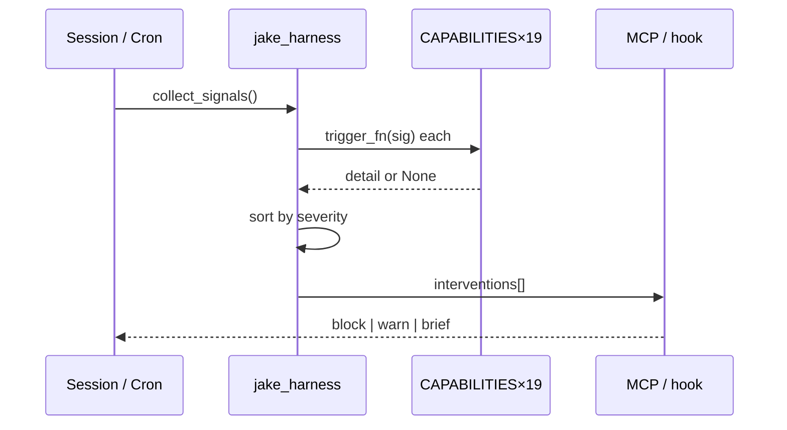
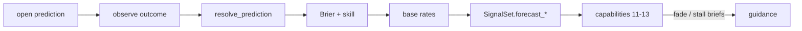
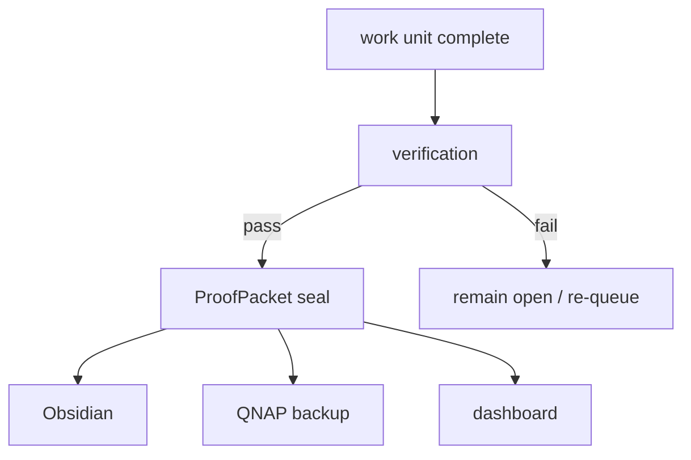
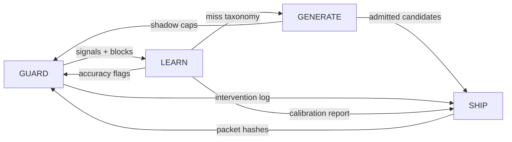
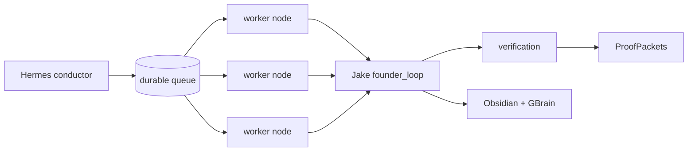

# RIG Memory OS — Architecture

**Version:** v10  
**Package:** `founder_runtime`  
**Core agent:** Jake (mega-harness + guidance + predictions)

This document expands the README diagram and names the four closed loops that keep the system honest.

---

## System diagram



### Data path (one line)

```
sessions → MCP → sqlite → predictor → jake → obsidian / qnap
```

Every hop is typed (`contracts.py`, `schemas.py`). Side effects that change detectors or canonical facts must pass `mutation_gate.judge` with a verifiable ledger entry.

---

## Component map

| Layer | Modules | Responsibility |
|-------|---------|----------------|
| Bus | `mcp_server.py`, `.mcp.json` | Expose memory + guidance tools to all harnesses |
| Store | `memory_gateway.py`, `store.py`, `postgres_*`, `migrations/` | Durable facts, episodes, prediction rows |
| Cortex | `predictor.py`, `prediction_*` | Claims, forecasts, resolve, calibration |
| Jake | `jake_harness.py`, `jake_guidance.py`, `jake_predictions.py`, `jake_observer.py` | Signal collection, 19 detectors, interventions |
| Trust | `mutation_gate.py`, `verification.py`, `canary.py` | Ledger, promotion, shadow → warning |
| Generative | `stigmergy.py`, `capability_proposals.py`, `override_miner.py` | Surface candidates from residue |
| Fleet | `fleet_probe.py`, `health_monitor.py`, `dispatcher.py`, `worker.py` | Multi-node runtime |
| Surfaces | `gbrain_obsidian_bridge.py`, `qnap_mount_supervisor.py`, `dashboard/`, `cockpit.py` | Human-readable + backup |
| Rhythm | `night_cycle.py`, `launchd_install.py`, `install_cron.py`, `flows.py` | Scheduled reconcile |

---

## The four loops

### 1. GUARD — stop irreversible mistakes in the live session

**Trigger:** every harness evaluation cycle (cron ~5 min, plus PreToolUse on Claude Code).  
**Input:** `SignalSet` from transcripts + git + forecast state.  
**Body:** evaluate all 19 `CAPABILITIES`; emit interventions sorted by severity (`blocking` → `warning` → `advisory`).  
**Output:** block/warn/brief payloads on the MCP bus and Obsidian guidance brief.  
**Hard blocks include:** `secret_file_guard`, `session_collision`, `mutation_gate_tamper`, `testless_multifile` (at threshold), `blind_edit_streak`, `same_file_fix_loop`.



### 2. LEARN — fold outcomes back into the predictor

**Trigger:** prediction resolution events + night cycle backfill.  
**Input:** open forecasts (`prediction_bridge`), observed outcomes.  
**Body:** `resolve_prediction` (idempotent) → Brier update → Laplace-smoothed base rates → calibration report (7d / 30d / 90d skill).  
**Output:** updated Reality Cortex claims; `forecast_accuracy` / `anti_calibrated` flags consumed by capabilities 11–13.  
**Invariant:** never emit p=1.0 on n=1; forbidden actions never become allowed via learning.



### 3. GENERATE — propose new detectors from residue, never auto-enable

**Trigger:** stigmergy residue, override mining, link-gap analysis.  
**Input:** repeated failure shapes not covered by the current 19.  
**Body:** `capability_proposals` + `stigmergy` write candidates → `canary` registers shadow severity → live evaluation without user-facing blocks.  
**Output:** `capability-18-pending.json` surfaced by `generative_shipper`.  
**Gate:** promotion shadow→warning only via `mutation_gate.judge` + ledger entry (capability 17 fails closed on tamper).

### 4. SHIP — seal evidence and push durable surfaces

**Trigger:** successful work units, night cycle, explicit verify.  
**Input:** interventions taken, predictions resolved, mutations admitted.  
**Body:** `verification.py` independent checks → ProofPacket seal → Obsidian notes via `gbrain_obsidian_bridge` → QNAP snapshot via `qnap_mount_supervisor`.  
**Output:** content-addressed packets under operator-controlled paths; dashboard/cockpit panels refreshed from `panel_data`.  
**Rule:** “done” means a gate exit code or packet hash — never a chat claim.



---

## Loop interactions



- **GUARD without LEARN** becomes nagging noise (see `guidance_fatigue`).  
- **LEARN without GUARD** never changes live behavior.  
- **GENERATE without the mutation gate** is a trust root breach.  
- **SHIP without verification** is theater — falsification tests exist to keep this red-capable.

---

## Trust boundaries

1. **Session code** may read memory and receive guidance; it may not write canonical facts or promote procedures directly (`FORBIDDEN_ACTIONS` in `predictor.py`).
2. **Detector source** (`jake_harness.CAPABILITIES`) changes only through gate-verified diffs.
3. **Ledger** is append-only and hash-chained; `mutation_gate_tamper` treats unreadable/broken chains as tamper (fail closed).
4. **External side effects** (messages, spend, merge) stay outside allowed prediction actions.

---

## Runtime topology (fleet)



Config lives in `config/` (`nodes.yaml`, `schedules.yaml`, `model_routes.yaml`, `approval_lanes.yaml`, `work_types.yaml`). macOS services under `services/macos/`; QNAP compose under `services/qnap/`.

---

## Capability index (19)

See the capability table in [`README.md`](../README.md#capabilities). Adding a capability is intentionally small:

1. Append a 6-tuple to `CAPABILITIES` in `jake_harness.py`, **or**
2. Register a shadow canary via `canary.py` and earn promotion through the gate.

No other wiring — Jake picks it up next cycle.

---

## Related entrypoints

| Command / module | Purpose |
|------------------|---------|
| `python -m founder_runtime.cli` | Operator surface |
| `founder_runtime.jake_harness` | Signal collect + evaluate |
| `founder_runtime.predictor` | Reality Cortex |
| `founder_runtime.mcp_server` | MCP tool host |
| `founder_runtime.night_cycle` | Scheduled reconcile |
| `test_jake_e2e_journeys.py` | Happy-path journeys |
| `test_jake_falsification.py` | Must-be-able-to-go-red suite |
| `test_agents_e2e.py` | Multi-agent e2e |

---

*RIG Memory OS v10 — sessions → MCP → sqlite → predictor → jake → obsidian/qnap.*
